# Hotel-Haven-Predicting-Booking-Cancellations-Before-They-Cost-Revenue
The project presents the project as an end-to-end business analytics and machine-learning solution, rather than simply a collection of charts.

# 🏨 Hotel Haven
## Predicting Booking Cancellations Before They Cost Revenue

**An end-to-end hotel analytics and machine-learning project that transforms reservation data into actionable cancellation-risk insights and an interactive prediction application.**


</div>

---

## 📌 Table of Contents

- [Project Overview](#-project-overview)
- [Business Problem](#-business-problem)
- [Project Objectives](#-project-objectives)
- [Dataset Overview](#-dataset-overview)
- [Project Workflow](#-project-workflow)
- [Key Findings](#-key-findings)
- [Machine-Learning Solution](#-machine-learning-solution)
- [Streamlit Application](#-streamlit-application)
- [Business Recommendations](#-business-recommendations)
- [Project Structure](#-project-structure)
- [Installation and Usage](#-installation-and-usage)
- [Limitations](#-limitations)
- [Future Improvements](#-future-improvements)
- [Author](#-author)

---

## 🌍 Project Overview

Hotel cancellations create a difficult planning problem. A room can appear booked in the reservation system but become available again shortly before arrival. This can lead to:

- Lost revenue
- Unused room inventory
- Inaccurate occupancy forecasts
- Inefficient staffing and resource allocation
- Poor pricing and overbooking decisions

**Hotel Haven** was developed to help hotel managers identify bookings that are more likely to be cancelled before the cancellation occurs.

The project combines:

1. **Exploratory data analysis** to understand booking behaviour.
2. **Business-focused insights** to identify the strongest cancellation patterns.
3. **Feature engineering** to create variables such as total guests and total nights.
4. **Machine-learning classification** to estimate cancellation risk.
5. **A Streamlit web application** that allows users to enter booking details and receive an immediate prediction with probabilities.

> The goal is not merely to predict cancellations. The goal is to help hotels make earlier, smarter and more profitable decisions.

---

## 💼 Business Problem

Hotels must decide how to allocate rooms, manage prices, schedule employees and forecast revenue before guests arrive. However, bookings are not equally reliable.

A reservation made months in advance by a first-time customer with no special requests may carry a very different level of risk from a reservation made by a repeat guest shortly before arrival.

The central business question is:

> **Can historical booking information be used to identify reservations that are likely to be cancelled?**

A reliable early-warning system can support:

- Targeted booking confirmations
- Smarter deposit and cancellation policies
- Better room inventory planning
- More accurate revenue forecasts
- Improved customer-retention strategies
- More controlled overbooking decisions

---

## 🎯 Project Objectives

This project was designed to:

- Measure the overall hotel cancellation rate.
- Identify the booking, customer and pricing factors associated with cancellation.
- Examine cancellation patterns across room types and market segments.
- Estimate the revenue exposure linked to cancelled bookings.
- Compare one-time and repeat-customer behaviour.
- Build a machine-learning model for cancellation prediction.
- Deploy the model through a simple and interactive Streamlit interface.
- Translate analytical findings into practical hotel-management recommendations.

---

## 📊 Dataset Overview

The analysis contains **36,285 hotel reservations** and covers customer, reservation, pricing and behavioural information.

### Main variables

| Category | Variables |
|---|---|
| Guest information | Number of adults, number of children, repeated guest |
| Stay information | Weekend nights, week nights, total nights |
| Booking behaviour | Lead time, previous cancellations, previous completed bookings |
| Product information | Room type, meal plan, parking requirement |
| Commercial information | Average room price, market segment |
| Engagement information | Number of special requests |
| Target variable | Booking status: `Canceled` or `Not_Canceled` |

### Target distribution

- **Not cancelled:** 24,396 bookings — **67.23%**
- **Cancelled:** 11,889 bookings — **32.77%**

This means that approximately **one in every three reservations was cancelled**, making cancellation prediction a meaningful operational problem.

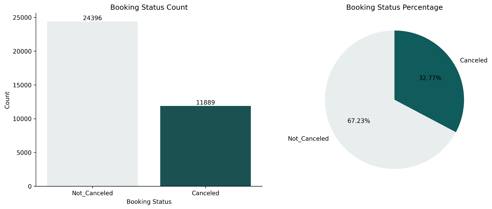

---

## 🔄 Project Workflow

```text
Business Understanding
        ↓
Data Collection and Inspection
        ↓
Data Cleaning and Validation
        ↓
Exploratory Data Analysis
        ↓
Feature Engineering
        ↓
Cancellation Pattern Analysis
        ↓
Model Training and Validation
        ↓
Probability-Based Prediction
        ↓
Streamlit Deployment
        ↓
Business Recommendations
```

### 1. Data understanding

The dataset was reviewed for:

- Data types
- Missing observations
- Category distributions
- Numerical summaries
- Unusual and extreme values
- Target-class balance

### 2. Feature engineering

New business-friendly variables were created, including:

- `total_guests` — adults plus children
- `total_nights` — weekend nights plus week nights
- Price bands
- Lead-time bands
- Customer type — one-time or repeat customer

### 3. Exploratory data analysis

Univariate, bivariate and multivariate analyses were used to answer questions such as:

- Which room types are most demanded?
- Which market channels generate the most bookings?
- Does cancellation risk rise with lead time?
- Are repeat customers more dependable?
- Are special requests associated with lower cancellation?
- How much booking value is connected to cancellations?

### 4. Predictive modelling

A supervised classification model was trained to classify each reservation as:

- `Canceled`
- `Not_Canceled`

The deployed model also returns class probabilities so that users can see the strength of the prediction rather than receiving only a label.

---

# 🔍 Key Findings

## 1. Cancellation is a major commercial risk

The hotel recorded a **32.77% cancellation rate**. Although most bookings remained active, cancellations were frequent enough to materially affect occupancy planning and expected revenue.

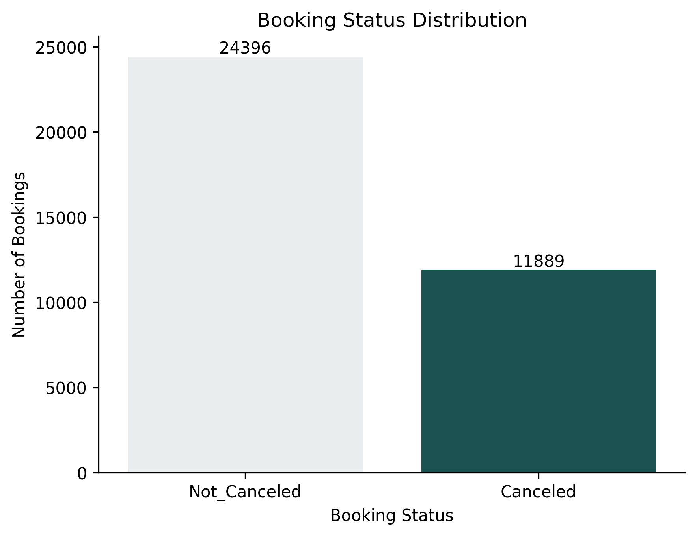

### Business meaning

A hotel treating every reservation as equally secure may overestimate future occupancy. A risk-based system can separate stronger reservations from bookings requiring additional attention.

---

## 2. Cancelled bookings represent substantial revenue exposure

The analysis associated:

- **7,054,162.38** with bookings that were not cancelled — **62%**
- **4,297,005.07** with cancelled bookings — **38%**

Cancelled reservations therefore represented **38% of the analysed booking value**. This should be interpreted as revenue exposure or potential revenue at risk, not necessarily realised revenue.

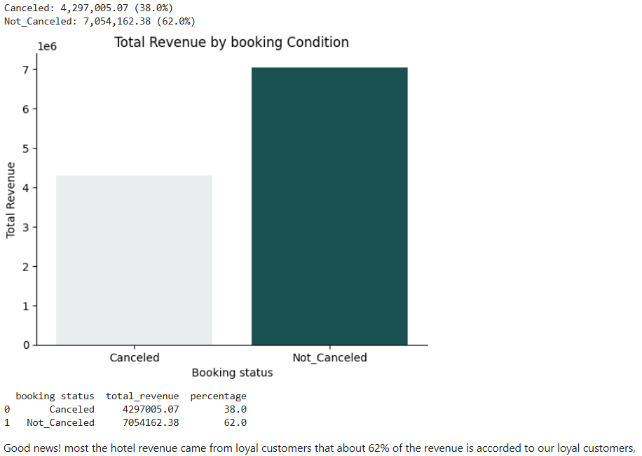

### Business meaning

Reducing even a small portion of preventable cancellations could protect a meaningful amount of expected revenue.

---

## 3. Repeat customers are dramatically more dependable

The cancellation rate was:

- **34% for one-time customers**
- **2% for repeat customers**

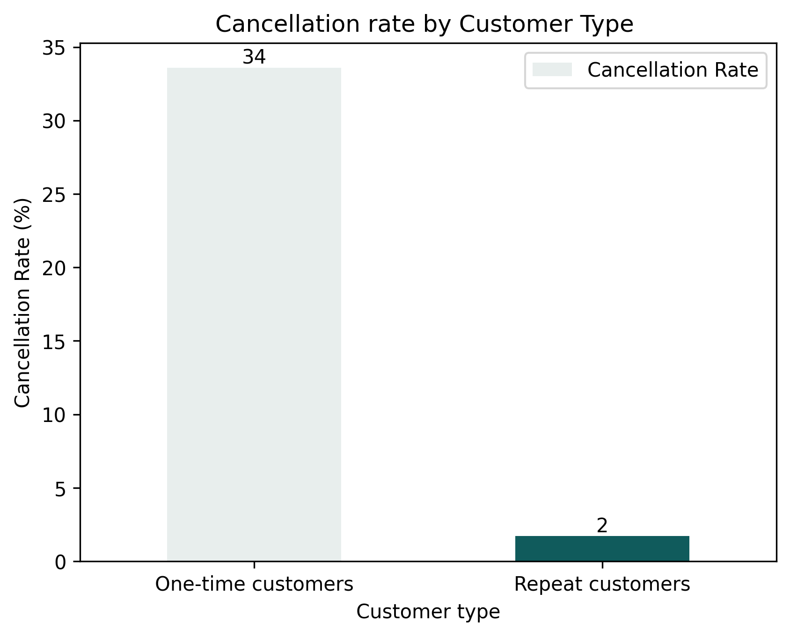

This is one of the strongest findings in the project.

### Business meaning

Repeat-guest status is a powerful reliability signal. Hotels should treat customer retention as both a marketing strategy and a revenue-risk strategy.

---

## 4. Special requests are associated with lower cancellation

Cancellation rates declined as the number of special requests increased:

| Special requests | Cancellation rate |
|---:|---:|
| 0 | 43% |
| 1 | 24% |
| 2 | 15% |
| 3–5 | 0% in the observed sample |

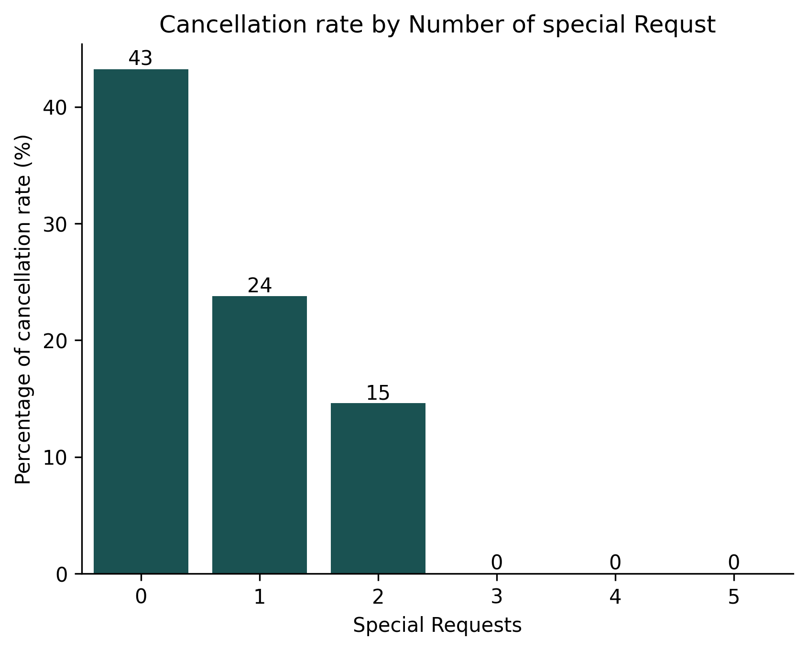

### Business meaning

Customers who make special requests may be more engaged with their stay and therefore more committed to the booking. The zero rates in the highest categories should be interpreted carefully because these categories may contain relatively few observations.

---

## 5. Longer lead times are linked to higher cancellation risk

The heatmap shows a clear pattern: cancellation risk generally increases as the number of days between booking and arrival becomes longer.

For example, within the lowest price range, the observed cancellation rate increased from **11.1%** for short lead times to **69.9%** for the longest lead-time group.

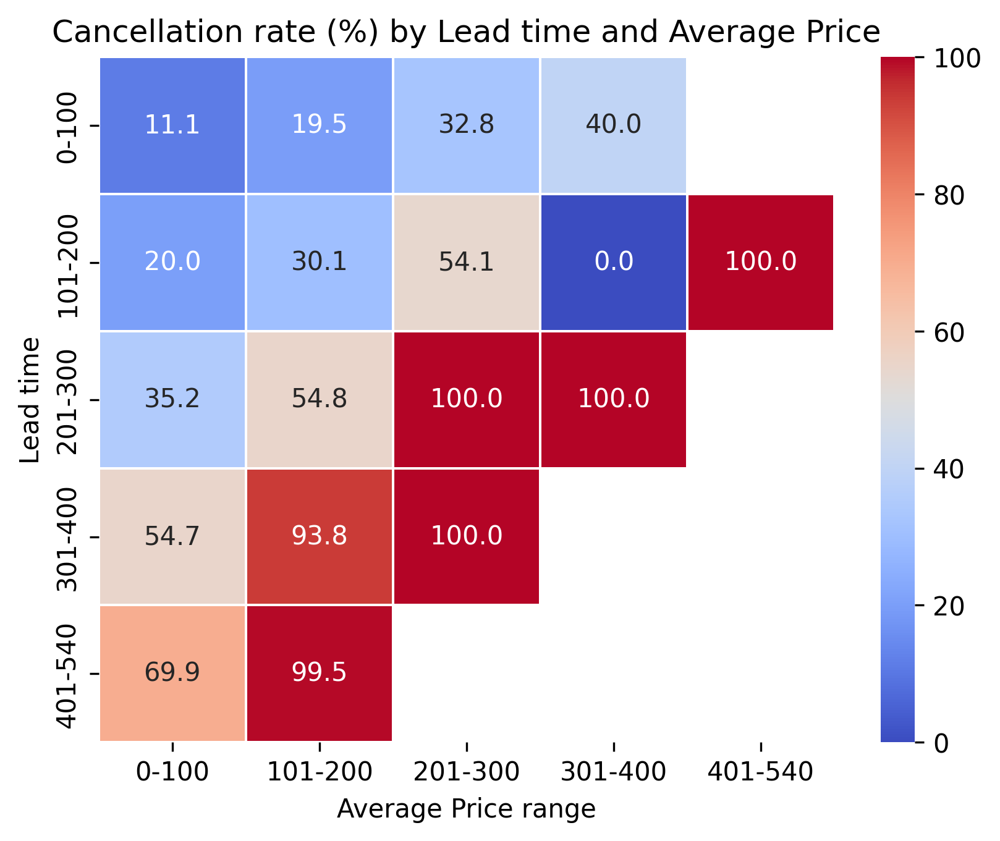

### Business meaning

Bookings made far in advance should receive earlier confirmation reminders, carefully designed deposit rules or other risk-control measures.

---

## 6. Lead time and price interact

Cancellation risk becomes especially high in several long-lead-time and higher-price combinations.

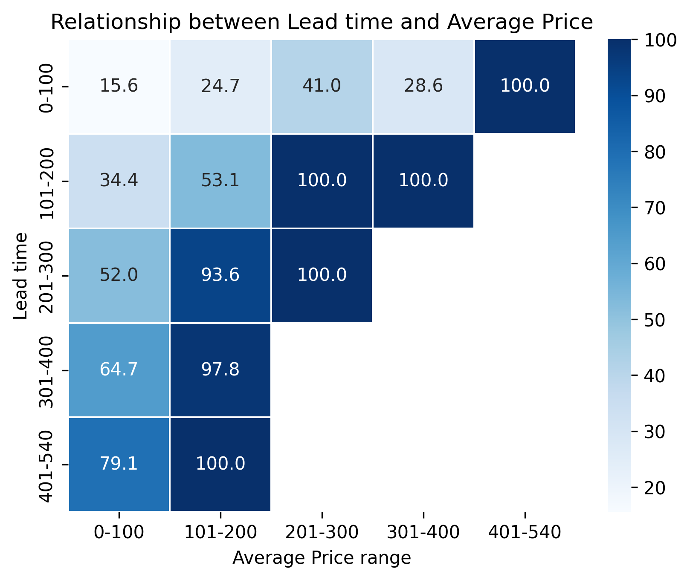

### Business meaning

Lead time and price should not be considered independently. A high-priced booking made far in advance may require stronger confirmation than a low-priced booking made close to arrival.

---

## 7. Online bookings dominate demand but carry elevated risk

Market-segment distribution:

- **Online:** 23,221 bookings — approximately **64.0%**
- **Offline:** 10,531 bookings — approximately **29.0%**
- **Corporate:** 2,017 bookings — approximately **5.6%**
- **Complementary:** 391 bookings — approximately **1.1%**
- **Aviation:** 125 bookings — approximately **0.3%**

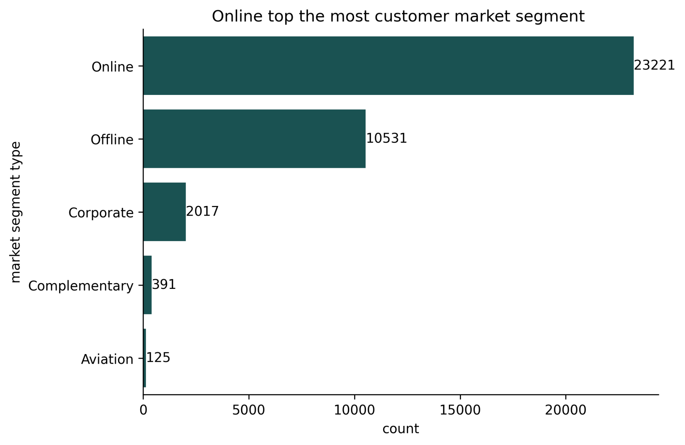

Observed cancellation rates included:

- **Online:** 37%
- **Offline:** 30%
- **Aviation:** 30%
- **Corporate:** 11%
- **Complementary:** 0% in the observed sample

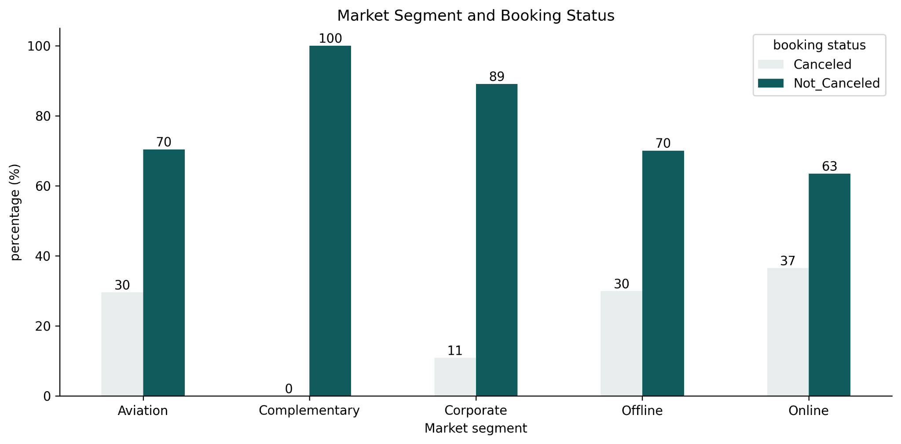

### Business meaning

The online channel is essential because it produces most reservations, but it is also the largest source of cancellations in both volume and rate among the major channels. Online confirmation journeys should therefore be a priority.

---

## 8. Demand is highly concentrated in one room type

**Room Type 1 accounted for 28,138 reservations, approximately 77.5% of all bookings.** Room Type 4 was a distant second with 6,059 bookings.

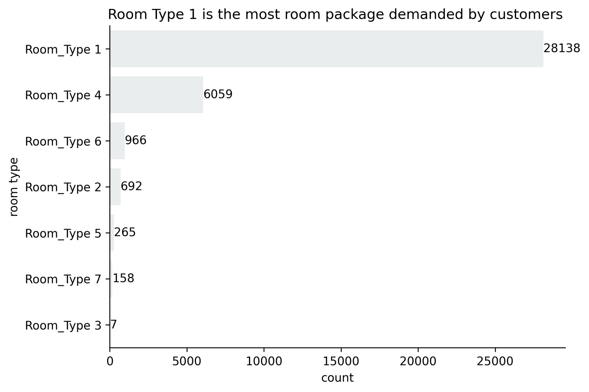

Cancellation rates varied by room type:

| Room type | Cancellation rate |
|---|---:|
| Room Type 1 | 32% |
| Room Type 2 | 33% |
| Room Type 3 | 29% |
| Room Type 4 | 34% |
| Room Type 5 | 27% |
| Room Type 6 | 42% |
| Room Type 7 | 23% |

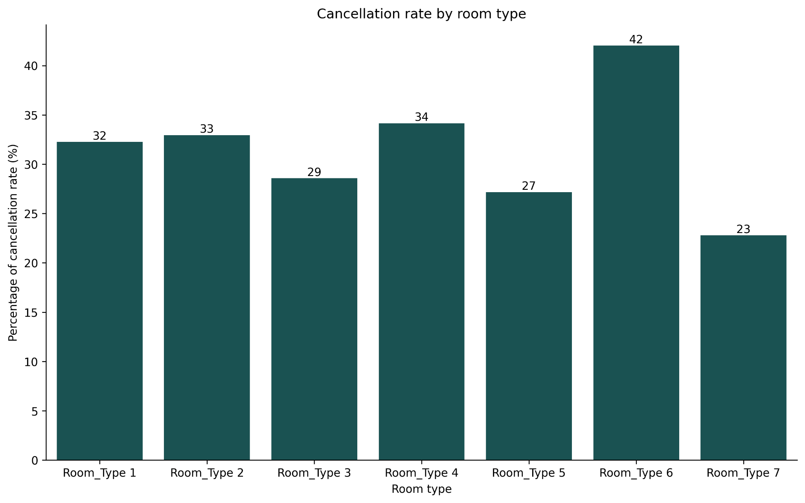

### Business meaning

Room Type 6 showed the highest cancellation rate, while Room Type 7 showed the lowest. However, low-volume room categories should be interpreted cautiously because small samples can produce unstable percentages.

---

## 9. Meal Plan 1 is the dominant package

Meal-plan demand was concentrated as follows:

- **Meal Plan 1:** 27,842 bookings — approximately **76.7%**
- **Not Selected:** 5,132 bookings — approximately **14.1%**
- **Meal Plan 2:** 3,306 bookings — approximately **9.1%**
- **Meal Plan 3:** 5 bookings

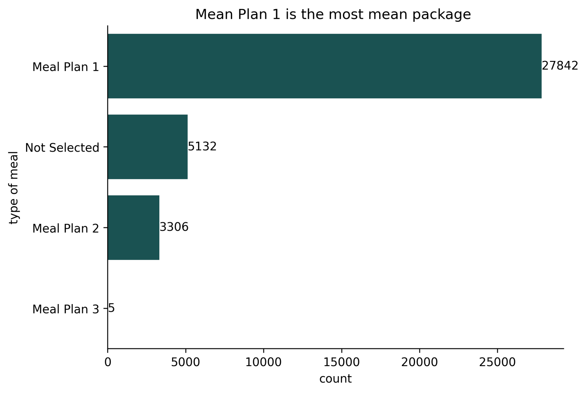

### Business meaning

Meal Plan 1 is the core product package. Pricing, availability and service-quality decisions around this plan can affect most customers.

---

## 10. Most bookings fall within the lower price bands

The overwhelming majority of reservations were priced within the `0–100` and `101–200` ranges.

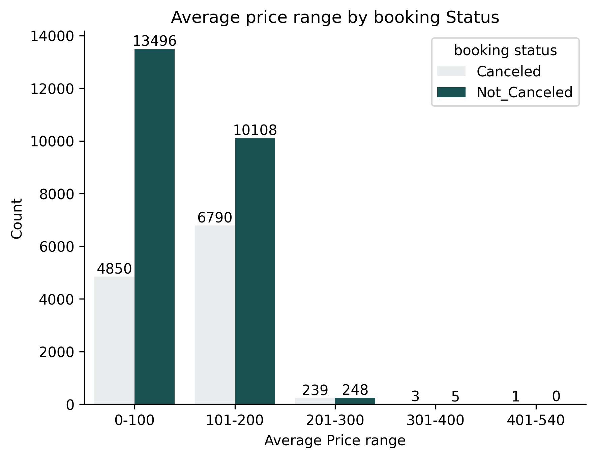

### Business meaning

Revenue-management interventions should focus first on the price bands containing the largest booking volume rather than on rare premium-price observations.

---

# 🤖 Machine-Learning Solution

## Prediction task

The model solves a **binary classification problem**:

```text
0 → Not Canceled
1 → Canceled
```

The Streamlit application uses six operationally meaningful inputs:

| Feature | Description | Business relevance |
|---|---|---|
| `lead_time` | Days between reservation and arrival | Longer waiting periods may increase uncertainty |
| `avg_price_per_room` | Average room price | Price may affect customer commitment and sensitivity |
| `no_of_special_requests` | Number of requests made by the guest | Engagement signal |
| `total_guests` | Adults plus children | Captures booking size |
| `total_nights` | Weekend plus weekday nights | Captures stay duration |
| `repeated_guest` | Whether the customer has stayed before | Strong loyalty and reliability signal |

## Prediction output

For each booking, the application returns:

- The predicted booking status
- Probability of cancellation
- Probability of remaining active
- A summary of the values used for prediction

## Why probability matters

A probability allows the hotel to create risk bands rather than treating every prediction the same way.

| Risk band | Example operational response |
|---|---|
| Low risk | Standard communication |
| Medium risk | Reminder or confirmation message |
| High risk | Personal follow-up, deposit review or inventory action |

> Prediction thresholds should be selected using the financial cost of a missed cancellation and the cost of unnecessarily contacting a reliable guest.

## Model evaluation

Before production use, the final model should be evaluated on unseen test data using:

- Accuracy
- Precision
- Recall
- F1-score
- ROC-AUC
- Confusion matrix
- Probability calibration

For this business problem, **recall for the cancelled class** is particularly important because a false negative represents a risky booking that the hotel failed to identify.

No test-set performance numbers are claimed in this README because a complete exported evaluation report was not included with the shared project files. This avoids overstating the model’s proven performance.

---

# 🖥️ Streamlit Application

The project includes an interactive application named:

```text
hotel_predictor.py
```

The application allows a hotel employee to enter booking information and generate an immediate prediction.

### Application capabilities

- Wide-screen responsive layout
- Custom dark hotel-themed interface
- User-friendly sliders and selection controls
- Probability-based cancellation output
- Separate visual states for risky and safe bookings
- Expandable view of the model inputs
- Cached model loading for faster repeated use

### User journey

```text
Enter booking details
        ↓
Click “Predict Cancellation”
        ↓
Model processes the six input features
        ↓
Application displays predicted class
        ↓
Application displays cancellation probabilities
        ↓
Hotel employee decides the appropriate action
```

---

# 💡 Business Recommendations

## 1. Build a risk-based confirmation process

Send automatic reminders based on predicted cancellation probability rather than using the same communication for every customer.

## 2. Prioritise long-lead-time bookings

Reservations made far in advance should receive scheduled reconfirmation messages before arrival.

## 3. Strengthen loyalty programmes

Repeat customers had a cancellation rate of only 2%. Encourage first-time customers to return through loyalty benefits, personalised offers and post-stay engagement.

## 4. Improve online-booking controls

Because online reservations dominate demand and show elevated cancellation risk, improve online payment, confirmation and reminder processes.

## 5. Use special requests as an engagement signal

Special requests were associated with lower cancellation. This variable can help strengthen the prediction model, but the relationship should not automatically be interpreted as causal.

## 6. Review high-risk room categories

Investigate why Room Type 6 recorded a higher cancellation rate. Possible areas for review include price, room description, availability, booking channel and customer expectations.

## 7. Connect prediction to revenue management

High-risk reservations can inform controlled overbooking, wait-list activation and room-release decisions. These actions should be governed by clear business rules and human review.

---

# 📁 Project Structure

```text
hotel-haven/
│
├── hotel.ipynb                      # Data analysis and experimentation
├── hotel_predictor.py               # Streamlit prediction application
├── gb_booking_model.pkl             # Trained model expected by the app
├── requirements.txt                 # Python dependencies
├── README.md                        # Project documentation
├── .gitignore
├── LICENSE
│
├── data/                             # Optional local data directory
│   ├── HotelData.xlsx
│   └── booking.xlsx
│
└── assets/
    └── images/
        ├── 01_booking_status_distribution.png
        ├── 02_meal_plan_distribution.png
        ├── 03_room_type_demand.png
        ├── 04_market_segment_distribution.png
        ├── 05_booking_status_overview.png
        ├── 06_price_range_booking_status.png
        ├── 07_revenue_by_booking_condition.png
        ├── 08_lead_time_price_relationship.png
        ├── 09_cancellation_heatmap.png
        ├── 10_room_type_booking_status.png
        ├── 11_market_segment_booking_status.png
        ├── 12_customer_loyalty_revenue.png
        ├── 13_cancellation_customer_type.png
        ├── 14_cancellation_special_requests.png
        └── 15_cancellation_room_type.png
```

> Keep private or licensed datasets out of the public repository unless redistribution is permitted.

---

# ⚙️ Installation and Usage

## 1. Clone the repository

```bash
git clone https://github.com/ueze241/hotel-haven-booking-cancellation.git
cd hotel-haven-booking-cancellation
```

## 2. Create a virtual environment

### Windows

```bash
python -m venv .venv
.venv\Scripts\activate
```

### macOS or Linux

```bash
python3 -m venv .venv
source .venv/bin/activate
```

## 3. Install dependencies

```bash
pip install --upgrade pip
pip install -r requirements.txt
```

## 4. Add the trained model

Place the model file in the project root:

```text
gb_booking_model.pkl
```

## 5. Run the Streamlit application

```bash
streamlit run hotel_predictor.py
```

Streamlit will display a local address similar to:

```text
http://localhost:8501
```

Open the address in your browser.

---

# 🧰 Technology Stack

| Tool | Purpose |
|---|---|
| Python | Main programming language |
| Pandas | Data manipulation and aggregation |
| NumPy | Numerical operations |
| Matplotlib | Data visualisation |
| Seaborn | Statistical visualisation |
| Scikit-learn | Machine-learning workflow |
| Joblib | Model serialisation and loading |
| Streamlit | Interactive web application |
| Jupyter Notebook | Analysis and model experimentation |
| Git and GitHub | Version control and project presentation |

---

# ⚠️ Limitations

- The analysis identifies associations, not proof of causation.
- Some room types and market segments contain very few observations; their percentages may be unstable.
- A reported 0% or 100% cancellation rate in a rare category should not automatically drive policy.
- Revenue linked to cancelled bookings should be interpreted as booking-value exposure rather than guaranteed lost revenue.
- Model performance may change when customer behaviour, prices or booking channels change.
- The model should be validated on recent hotel data before operational use.
- Predictions should support staff decisions, not replace human judgement.
- Sensitive customer attributes should not be added without a clear, lawful and fair business justification.

---

# 🚀 Future Improvements

The project can be extended through:

- Hyperparameter optimisation
- Cross-validation and threshold tuning
- Class-weighting or cost-sensitive learning
- SHAP-based model explanations
- Feature-importance visualisation
- Probability calibration
- Experiment tracking with MLflow
- Automated data-validation tests
- Model-drift monitoring
- FastAPI prediction endpoint
- Cloud deployment
- Database integration
- Authentication for hotel staff
- Downloadable prediction reports
- Batch scoring of future bookings
- A dashboard showing risk by arrival date, room type and channel
- A/B testing of cancellation-prevention interventions

---

# 📷 Additional Visual Analysis

### Room type and booking status

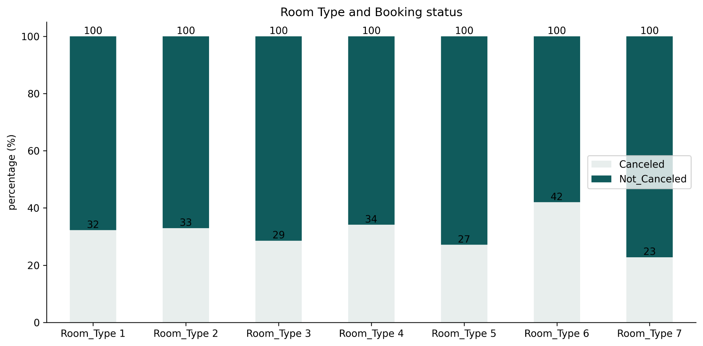

### Customer loyalty and average booking value

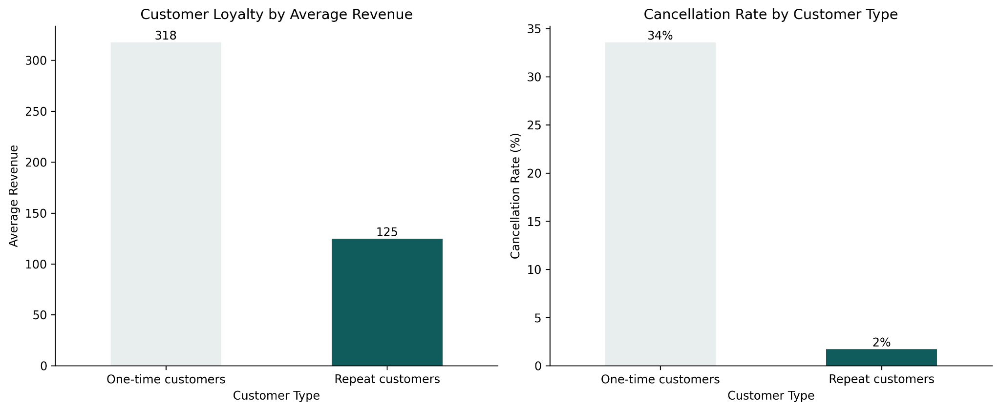

---

# ✅ Project Value

Hotel Haven demonstrates the ability to move from a business problem to a deployable analytical product:

- Asking commercially relevant questions
- Cleaning and transforming reservation data
- Communicating patterns through visualisation
- Engineering meaningful predictive features
- Building a classification workflow
- Translating predictions into business decisions
- Deploying a user-facing machine-learning application

This is not only a data-analysis project. It is a practical decision-support system for hotel revenue and occupancy management.

---

# 👤 Author

## Uchechukwu Eze

Data Scientist | Data Analyst | Economics and Business Analytics

- GitHub: [@uchechukwu.nca@gmail.com](https://github.com/uchechukwu.nca@gmail.com)
- Project focus: Machine learning, predictive analytics, economic analysis and business intelligence

---

<div align="center">

### ⭐ Support the project

If this project is useful, consider starring the repository and sharing your feedback.

**Built with Python, machine learning and a passion for solving real business problems.**

</div>
